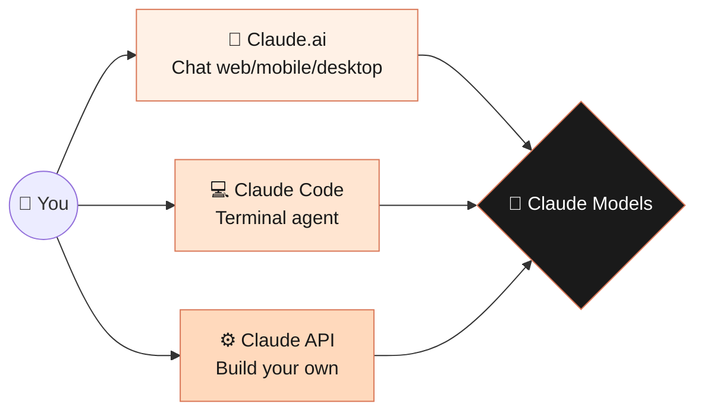
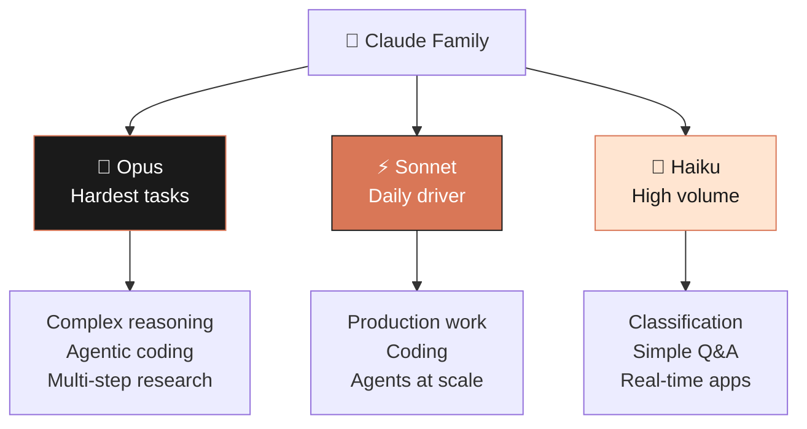
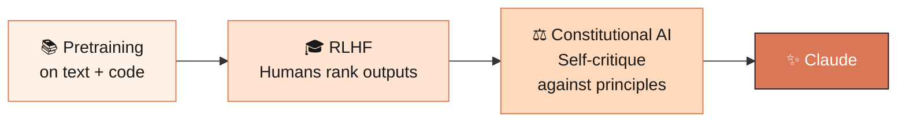
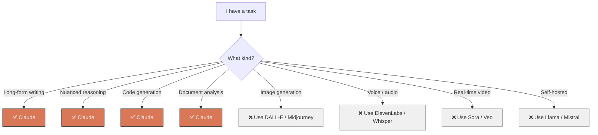

# Module 01 — Introduction to Claude

> **Goal:** By the end of this module, you'll know what Claude is, how the model family works, and when to reach for Claude versus other AI tools.

⏱️ **~10 minutes** &nbsp;&nbsp;&nbsp; 📊 **3 diagrams** &nbsp;&nbsp;&nbsp; 🎯 **No setup required**

---

## 1.1 What is Claude?

**Claude** is a family of large language models (LLMs) built by [Anthropic](https://www.anthropic.com), an AI safety company founded in 2021. You interact with Claude through three main surfaces:



What sets Claude apart:

- 🧠 **Strong reasoning and writing** — excellent at long-form analysis, nuanced writing, complex instructions
- 💻 **Best-in-class coding** — widely considered top-tier for software development
- 🛡️ **Built around safety** — trained with *Constitutional AI* to be helpful, harmless, honest
- 📚 **Long context** — modern Claude can read up to **1 million tokens** (~750,000 words)

---

## 1.2 The Claude Model Family

Anthropic releases models in three "sizes" named after literary forms — each balancing intelligence, speed, and cost differently.



### The intelligence vs. speed vs. cost tradeoff

```
                          INTELLIGENCE
                              ▲
                       💎 Opus│
                              │
                              │
                              │  ⚡ Sonnet
                              │
                              │
                              │            🚀 Haiku
                              └──────────────────────────►
                                                  SPEED & COST


   Pick Opus when:  the task is hard and quality > everything
   Pick Sonnet:     90% of production work — the best default
   Pick Haiku when: volume is huge, latency is tight, cost matters
```

> 💡 The current frontier model is **Claude Opus 4.7**, with **Sonnet 4.6** and **Haiku 4.5** rounding out the family. Anthropic regularly releases new versions — always [check the official docs](https://docs.claude.com/en/docs/about-claude/models/overview) for the latest.

### Model versioning, briefly

Models use names like `claude-opus-4-7` or dated snapshots like `claude-sonnet-4-5-20250929`. For production, **pin a dated version** so behavior doesn't shift underneath you when Anthropic ships an update.

---

## 1.3 How Claude Was Trained (The Short Version)

Claude is a **transformer** trained on a huge corpus of text and code, then refined with two key techniques:



1. **RLHF (Reinforcement Learning from Human Feedback)** — humans rank model outputs to teach what "good" looks like.
2. **Constitutional AI** — Claude is trained to critique and revise its own outputs against a written set of principles (a "constitution"). This reduces reliance on expensive human labeling and bakes in values like honesty, helpfulness, and avoiding harm.

The constitution is publicly available and has grown from ~2,700 words in 2023 to ~23,000 words in 2026.

---

## 1.4 What Claude Is Good At

```
┌─────────────────────────────────────────────────────────────┐
│  ✍️  WRITING       essays, emails, copy, docs, fiction      │
│  💻  CODING        write, review, debug, refactor, explain  │
│  🔍  ANALYSIS      summarize, compare, extract structured   │
│  🧮  REASONING     multi-step problems, math, logic         │
│  🌐  TRANSLATION   strong across dozens of languages        │
│  👁️   VISION        images, charts, screenshots, handwriting │
│  🧰  AGENTS        tool use, browsing, code execution        │
└─────────────────────────────────────────────────────────────┘
```

---

## 1.5 What Claude *Isn't* Good At (Honest Limits)

```
┌─────────────────────────────────────────────────────────────┐
│  ❌  Real-time facts (without web search)                   │
│      Knowledge cutoff: ~Jan 2026 for current models         │
│                                                             │
│  ❌  Heavy math at scale                                    │
│      Give it a calculator (code execution tool)             │
│                                                             │
│  ❌  Confidently wrong sometimes                            │
│      Like all LLMs — verify critical claims                 │
│                                                             │
│  ❌  Cross-session memory by default                        │
│      Use Memory feature or Projects to persist context      │
│                                                             │
│  ❌  Generating images/audio/video                          │
│      Text + vision-input only — pair with other tools       │
└─────────────────────────────────────────────────────────────┘
```

---

## 1.6 When to Use Claude vs. Alternatives



A pragmatic mental model: **keep accounts on 2–3 AI tools** and route tasks to whichever shines. This course will make you world-class with Claude specifically.

---

## 1.7 The Three Surfaces (Visual Tour)

```
╔════════════════════╗  ╔════════════════════╗  ╔════════════════════╗
║   💬 Claude.ai     ║  ║  💻 Claude Code    ║  ║   ⚙️  Claude API    ║
╠════════════════════╣  ╠════════════════════╣  ╠════════════════════╣
║  Chat UI in        ║  ║  Terminal agent    ║  ║  Programmatic      ║
║  browser, mobile,  ║  ║  for coding tasks  ║  ║  access for        ║
║  desktop           ║  ║                    ║  ║  developers        ║
║                    ║  ║                    ║  ║                    ║
║  Best for:         ║  ║  Best for:         ║  ║  Best for:         ║
║  • thinking        ║  ║  • multi-file      ║  ║  • building apps   ║
║  • writing         ║  ║    refactors       ║  ║  • automations     ║
║  • daily knowledge ║  ║  • shipping code   ║  ║  • integrations    ║
║    work            ║  ║    fast            ║  ║                    ║
║                    ║  ║                    ║  ║                    ║
║  → Module 04       ║  ║  → Module 05       ║  ║  → Module 06       ║
╚════════════════════╝  ╚════════════════════╝  ╚════════════════════╝
```

---

## 1.8 A Note on Ethics & Responsible Use

You're going to get extraordinarily capable at directing an AI. With that comes responsibility:

| 🔒 | **Don't paste secrets** (API keys, passwords, customer PII) into chats unless you understand the data policies |
| --- | --- |
| 📝 | **Disclose AI involvement** when professional or academic norms call for it |
| 🎯 | **Verify before you ship.** Claude is a collaborator, not an oracle |
| 🧭 | **Avoid using Claude to deceive, harass, or harm.** It's against the terms — and just bad practice |

---

## ✅ Module 1 Checkpoint

You should now be able to answer:

- [ ] Name the three Claude model "sizes" and describe their tradeoffs
- [ ] What does Constitutional AI do?
- [ ] Name three things Claude is great at, and two it isn't
- [ ] What's the difference between Claude.ai, Claude Code, and the Claude API?

> 👉 **Next up:** [Module 02 — Getting Started](../02-getting-started/) — sign up, set up, and have your first real conversation.
