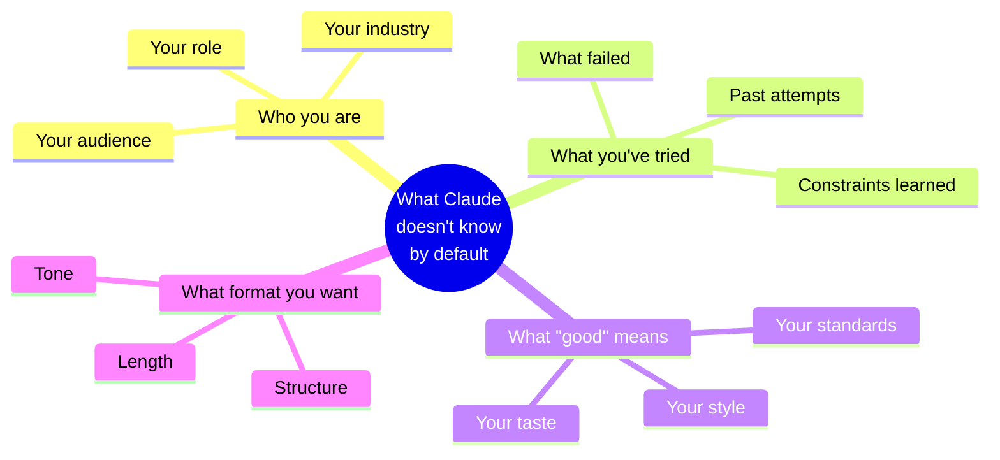
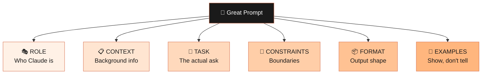
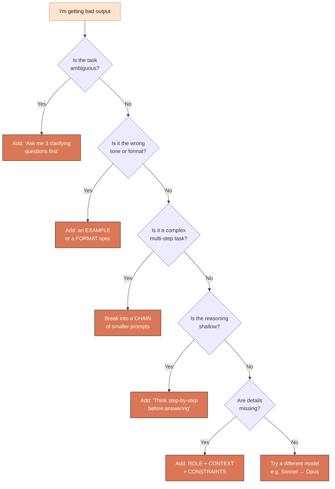
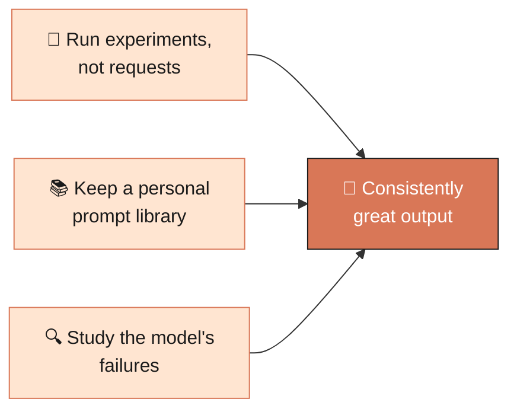

# Module 03 — Prompt Engineering with Claude

> **Goal:** Move from "vibes-based" prompting to a repeatable system that gets great output from Claude every time.

⏱️ **~25 minutes** &nbsp;&nbsp;&nbsp; 📊 **5 diagrams** &nbsp;&nbsp;&nbsp; 🎯 **The most important module in the course**

---

## 3.1 The Mental Model

A prompt is a **brief to a brilliant but contextless collaborator**. Claude has read most of the public internet — but it doesn't know:



Your job as the prompter is to **close that gap fast**. The single biggest improvement most people can make: **stop writing one-line prompts** and start writing 3–10 line briefs.

---

## 3.2 The Anatomy of a Great Prompt

Almost every excellent prompt contains some mix of these six ingredients. **Memorize them.**



| Ingredient | What it does | Mini-example |
|---|---|---|
| 🎭 **Role** | Sets perspective | *"You are a senior product manager at a fintech startup."* |
| 📋 **Context** | Background info | *"We're launching a new card next month, target = young professionals."* |
| 🎯 **Task** | The actual ask | *"Draft a 3-tier pricing page."* |
| 📐 **Constraints** | Boundaries | *"Max 200 words per tier. No marketing fluff."* |
| 📦 **Format** | Output shape | *"Return as a markdown table with: Tier \| Price \| Top 3 features."* |
| 🌟 **Examples** | Show, don't tell | *"Match how Stripe writes — clean, technical, confident."* |

> 💡 Not every prompt needs all six. But if you find Claude's output disappointing, **look at this list** and ask: *which ingredient did I leave out?*

---

## 3.3 Beginner vs. Pro — visualized

```
┌─────────────────────────────────────────────────────────────────────┐
│                                                                     │
│  ❌  BEGINNER:  "write me a cover letter for a PM job"              │
│                                                                     │
│      ▼  produces ▼                                                  │
│                                                                     │
│      🤷  Generic Mad Libs template you can't actually send          │
│                                                                     │
└─────────────────────────────────────────────────────────────────────┘

┌─────────────────────────────────────────────────────────────────────┐
│                                                                     │
│  ✅  PRO:                                                           │
│                                                                     │
│  🎭   You are an executive writing coach...                         │
│                                                                     │
│  📋   <resume>...</resume>                                          │
│       <job_description>...</job_description>                        │
│       <context>I met the hiring manager at a conference...</context>│
│                                                                     │
│  🎯   Write a cover letter that:                                    │
│  📐    - Under 300 words                                            │
│  📐    - Opens with a specific hook (not "I'm writing to apply...") │
│  📐    - Explicitly connects 2-3 resume bullets to the JD           │
│  📐    - References the conference meeting naturally                │
│  📐    - Sounds like a confident peer, not a desperate applicant    │
│                                                                     │
│  📦   Then in a section called "What I changed and why",            │
│       explain your top 3 stylistic choices.                         │
│                                                                     │
│      ▼  produces ▼                                                  │
│                                                                     │
│      ✨  Output you can actually send                               │
│                                                                     │
└─────────────────────────────────────────────────────────────────────┘
```

---

## 3.4 The 10 Core Techniques


### 1. Be specific about the audience

❌ *"Explain quantum computing."*
✅ *"Explain quantum computing to a smart 12-year-old who loves video games. Use 1–2 analogies."*

### 2. Give an example of "good"

When you have it, paste a sample. Claude is extraordinarily good at matching tone and structure when you **show** rather than describe.

```
Here's a tweet I wrote that I'm proud of:
"[paste tweet]"

Now write 5 more in the same voice on the topic of [X].
```

### 3. Break complex tasks into steps

Instead of one giant prompt, walk Claude through a **process**:

```
We're going to write a blog post about [topic]. Let's do it in stages:

Step 1: Brainstorm 10 angles. I'll pick one.
Step 2: Build an outline with H2s and key points.
Step 3: Write the intro only. I'll review.
Step 4: Write the body section by section.

Start with Step 1.
```

This is called **prompt chaining** and it produces dramatically better long-form work.

### 4. Use chain-of-thought ("think step by step")

For reasoning, math, or complex analysis, ask Claude to **show its work** before the answer:

```
Before giving your final answer, work through the problem step by step.
Then give the answer in a clearly labeled "Final answer:" line.
```

### 5. Use XML tags to structure long prompts

Claude was specifically trained to pay attention to XML-style tags. For prompts with multiple inputs, this is gold:

```xml
<context>
Our company sells handmade leather goods, founded in 2018, based in Portland.
</context>

<draft>
[paste your draft]
</draft>

<task>
Edit the draft above for clarity. Preserve the brand voice described in <context>.
Return only the edited version.
</task>
```

### 6. Use few-shot examples

```
Convert customer messages into structured tickets.

Input: "My order hasn't arrived and it's been 2 weeks!"
Output: {"category": "shipping", "priority": "high", "sentiment": "negative"}

Input: "Loving the new feature, when's the next update?"
Output: {"category": "feedback", "priority": "low", "sentiment": "positive"}

Input: "Site is down, can't log in."
Output:
```

### 7. Tell Claude what *not* to do

- *"Don't apologize."*
- *"Don't add disclaimers."*
- *"Don't suggest I consult a professional."*
- *"Don't summarize at the end."*

### 8. Ask Claude to ask *you* questions first

```
Before you start, ask me 3 clarifying questions that would
most change your approach.
```

This single trick will save you hours of bad output.

### 9. Set the role at the **end**, not the beginning

Counterintuitive but it works for long prompts. Putting the role/instruction at the end keeps it fresh in Claude's "working memory":

```
[long context...]
[example data...]

Given everything above, act as a forensic accountant and identify
the three most suspicious entries.
```

### 10. Iterate, don't restart

If output is 80% right, **ask for surgical edits** — don't redo the whole prompt:

- *"Tighten paragraph 2."*
- *"Make the tone less corporate."*
- *"Replace the bullet list in section 3 with a paragraph."*

---

## 3.5 The Prompt Quality Decision Tree



---

## 3.6 Three High-Value Prompt Patterns

### 🅰️ Pattern A — The "Explain it to me"

```
Explain [concept] using:
- A 1-sentence ELI5
- A concrete real-world analogy
- The technical definition
- One common misconception people have

Keep the whole thing under 250 words.
```

### 🅱️ Pattern B — The "Critique my work"

```
You're an experienced [role]. Below is my [draft/code/plan].

<work>
[paste]
</work>

Give me:
1. Three things working well (be specific, not generic)
2. Three things to improve, ranked by impact
3. One bold suggestion I probably haven't considered

Be direct. I'd rather be helped than flattered.
```

### 🅲️ Pattern C — The "Decision helper"

```
I'm deciding between [Option A] and [Option B]. Context:
- [your situation]
- [constraints]
- [what success looks like]

Don't just list pros/cons. Tell me:
1. Which option you'd pick and why
2. The one scenario where you'd flip your answer
3. What I should learn or test before deciding

Push back on my framing if you think I'm asking the wrong question.
```

---

## 3.7 Common Mistakes & Fixes

```
┌──────────────────────────────────┬──────────────────────────────────┐
│  ❌  MISTAKE                     │  ✅  FIX                         │
├──────────────────────────────────┼──────────────────────────────────┤
│  One-line prompts                │  Add role + context + format     │
│  Yes/no on complex topics        │  Ask for tradeoffs + conditions  │
│  Stuffing 10 tasks in one prompt │  Split into a chain              │
│  Vague feedback ("make it nice") │  Be specific: "shorter,formal"   │
│  Re-explaining context every turn│  Use a Project (Module 04)       │
│  Accepting first answer          │  Ask "what would 50% better be?" │
└──────────────────────────────────┴──────────────────────────────────┘
```

---

## 3.8 The Prompt Engineering Mindset

The best prompters share three habits:



When Claude misfires, ask *"what was missing in my prompt?"* — not *"why is the AI dumb?"*

---

## ✅ Module 3 Checkpoint

You should now be able to:

- [ ] Identify the **6 ingredients** of a great prompt
- [ ] Use **XML tags** to structure complex inputs
- [ ] Apply **chain-of-thought**, **few-shot**, and **role** prompting
- [ ] Diagnose why a prompt isn't working (use the decision tree!)

> 🏋️ **Exercise:** Take a prompt you used last week and **rewrite it** using everything from this module. Compare the outputs side-by-side.

> 👉 **Next up:** [Module 04 — Claude.ai Features](../04-features/) — Projects, Artifacts, Files, Memory, and Connectors.

---

## 📚 Further reading

- [Anthropic's official prompt engineering guide](https://docs.claude.com/en/docs/build-with-claude/prompt-engineering/overview)
- [The Prompt Library on docs.claude.com](https://docs.claude.com/en/prompt-library/library)
- [The full prompt cookbook in this course](../09-resources/prompt-cookbook.md) — 30 ready-to-use prompts
