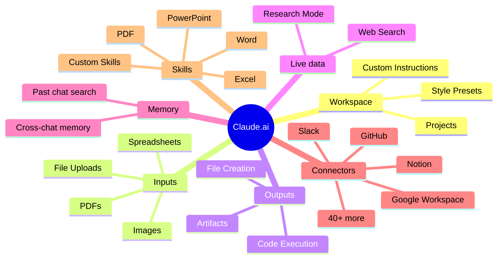
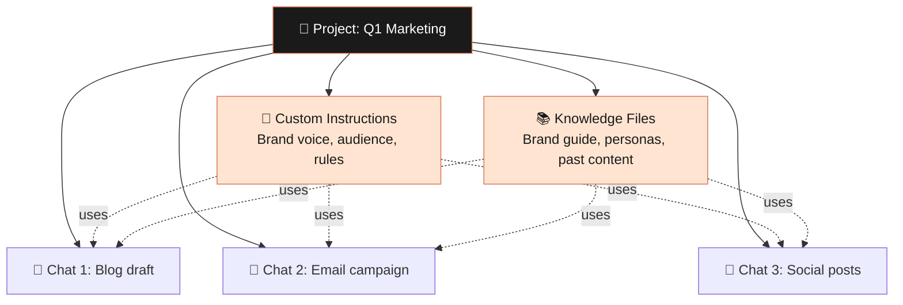
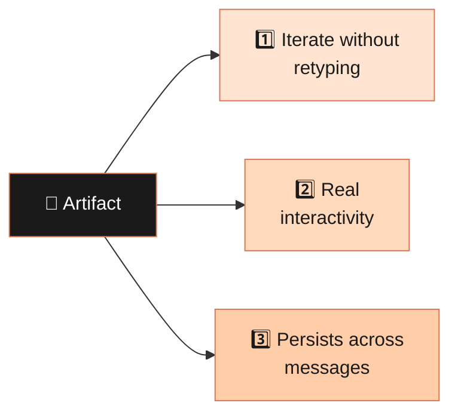
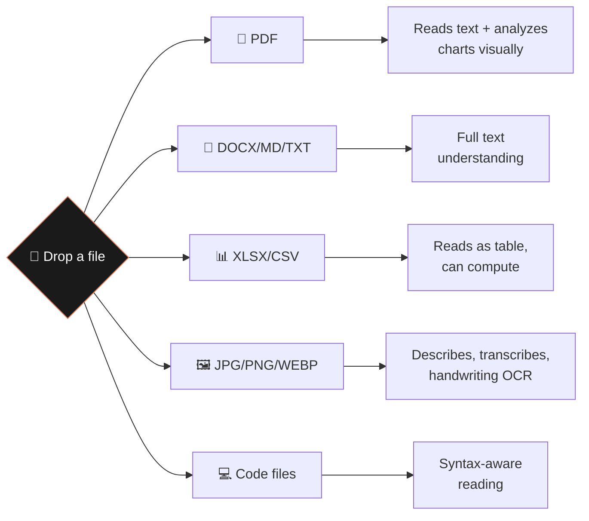
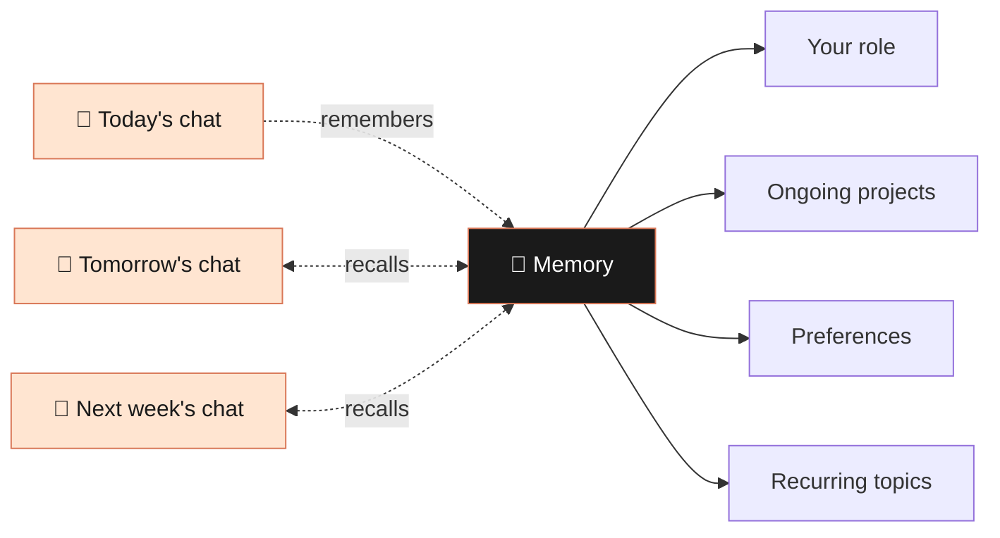
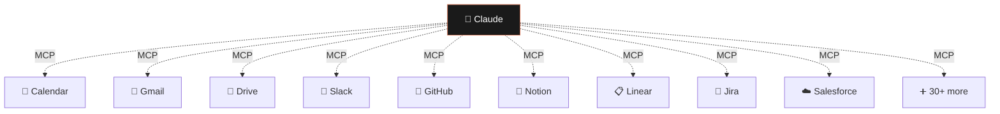
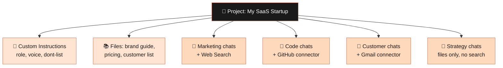

# Module 04 — Mastering Claude.ai Features

> **Goal:** Go beyond chat. Learn the features that make Claude.ai feel less like a chatbot and more like a workspace.

⏱️ **~20 minutes** &nbsp;&nbsp;&nbsp; 📊 **4 diagrams** &nbsp;&nbsp;&nbsp; 🎯 **Pro account recommended**

---

## 4.1 The Claude.ai feature universe



---

## 4.2 Projects — Persistent Workspaces

A **Project** is a folder that gives Claude long-term context.



### When to use a Project

| Use case | Why a Project |
|---|---|
| 📘 Writing a book or thesis | Upload outline + chapters → Claude has the full context every time |
| 💻 Working on a codebase | Upload README + key files → no re-explaining the architecture |
| 🏢 Building a brand | Upload tone guides + customer personas → consistent voice |
| 📊 Ongoing research | Keep all interviews, sources, notes in one searchable place |

### Custom instructions template

```
About me:
- I'm a [role] at [company]
- I'm building [project/product]
- My audience is [who]

How to help me:
- Default to concise, direct answers — skip the "Great question!" preamble
- When I share writing, give edits inline (don't rewrite everything)
- Push back if my reasoning has holes
- Ask 1–2 clarifying questions before starting big tasks

What's in this project:
- [list key files and what they are]
```

> ⚡ **Pro move:** Periodically ask the chat *"Based on what's in this project, what's the best next thing for me to work on?"* — you'll be surprised.

---

## 4.3 Artifacts — Living Documents and Apps

When you ask Claude to create something substantial, it puts the output in an **Artifact**: a side panel you can edit, iterate on, and even run.

```
┌─────────────────────────────────────────────────────────────────┐
│  💬 Chat                          │  📄 Artifact                │
│                                   │                             │
│  You: build me a habit tracker    │   ┌──────────────────────┐  │
│                                   │   │  Habit Tracker v1    │  │
│  Claude: Here's a React app...    │   │  ☐ ☐ ☑ ☑ ☐ ☐ ☑      │  │
│                                   │   │  ☑ ☑ ☑ ☐ ☐ ☑ ☑      │  │
│  You: make the streak counter    │   │  Streak: 4 days 🔥   │  │
│  bigger and orange                │   └──────────────────────┘  │
│                                   │                             │
│  Claude: Updated! 🎨              │   [edited live in place]   │
└───────────────────────────────────┴─────────────────────────────┘
```

### Three superpowers of Artifacts



### What can be an Artifact?

📝 Markdown documents · 🐍 Code files · ⚛️ React apps · 🌐 HTML pages · 📊 Charts (Mermaid) · 🎨 SVG graphics

### Killer Artifact prompts

```
Build me a single-page React app: a habit tracker for the next 30 days.
- Each row is a habit, each column is a day
- Click a cell to toggle done/undone
- Show a streak counter per habit
- Use a clean, minimal design — Tailwind, no external deps
```

---

## 4.4 File Uploads — The Input Universe



### Killer use cases

| | |
|---|---|
| 📄 | *"Here's a 60-page contract. Summarize my obligations, flag anything unusual."* |
| 📊 | *"Here's last quarter's sales CSV. Find 3 trends I'd miss at a glance."* |
| 🖼️ | *"Here's a screenshot of my dashboard. What's the most concerning metric?"* |
| ✍️ | *"Here's my draft. Read it once, then list the 5 weakest sentences with rewrites."* |

> 💡 **Pro move:** combine Files + Projects. Upload reference material into the Project once, then start fresh chats that all have access — no re-uploading.

---

## 4.5 Web Search — Live Information

Toggle the **🌐 web search** button and Claude searches the web in real time, citing sources inline.

```
✅ ENABLE search for:                    ❌ SKIP search for:

  📰 News, current events                  💭 Pure reasoning
  💰 Pricing, stocks, weather              ✍️ Brainstorming
  🚀 Recent product launches               📝 Writing tasks
  🔍 Verifying claims                      📁 Files you've already uploaded
  📚 Finding sources                       🤐 Confidential strategy
```

For bigger questions, **Research mode** runs many searches across many minutes and builds a structured, sourced report.

---

## 4.6 Memory — Cross-Conversation Continuity



You're in control:

- *"What do you remember about me?"* → see the current state
- *"Forget that I work at Acme — I changed jobs."* → update or erase
- Disable any time in Settings

---

## 4.7 Connectors (MCP) — Plugging Claude Into Your Tools

**MCP (Model Context Protocol)** is an open standard that lets Claude talk to other apps.



### When connectors shine

```
You: Look at my calendar for next week and my open Linear tickets.
Suggest a daily plan that protects 2 hours of focused coding time.
```

That single message hits two connectors and produces a real plan tied to your real life. **This is where Claude stops feeling like a chatbot.**

---

## 4.8 Skills — Reusable Expertise Packs

```
┌────────────────────────────────────────────────────────┐
│  📊  PowerPoint Skill   →  Real .pptx decks            │
│  📈  Excel Skill        →  Spreadsheets + formulas     │
│  📝  Word Skill         →  Polished .docx reports      │
│  📄  PDF Skill          →  Form filling, merging       │
│  🛠️   Custom Skills      →  Your team's expertise       │
└────────────────────────────────────────────────────────┘
```

You don't usually invoke these manually — Claude reaches for the right skill when the task calls for it. Asking for *"a sales deck as a real .pptx"* hits a different code path than asking for *"slide content."*

---

## 4.9 Putting It All Together — The Power-User Stack



---

## ✅ Module 4 Checkpoint

You should now know how to:

- [ ] Set up a Project with custom instructions and files
- [ ] Use Artifacts for code, docs, and small apps
- [ ] Upload files (PDFs, images, spreadsheets) and ask the right questions
- [ ] Toggle Web Search vs. Research mode appropriately
- [ ] Manage Memory and connect external tools via MCP

> 👉 **Next up:** [Module 05 — Claude Code](../05-claude-code/) — graduating from chat to agentic coding in your terminal.
