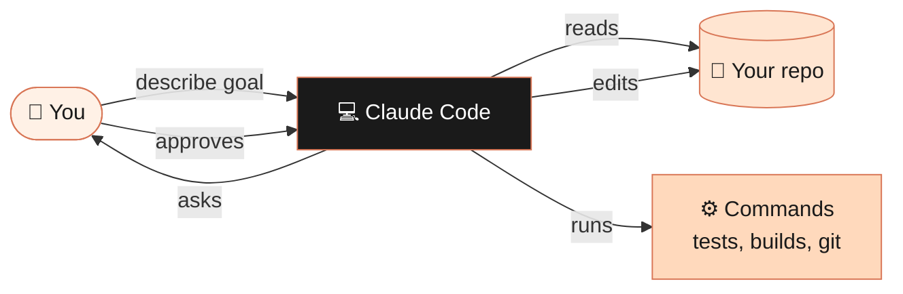
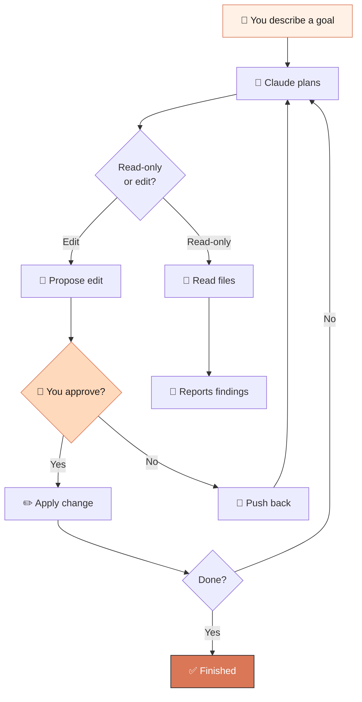
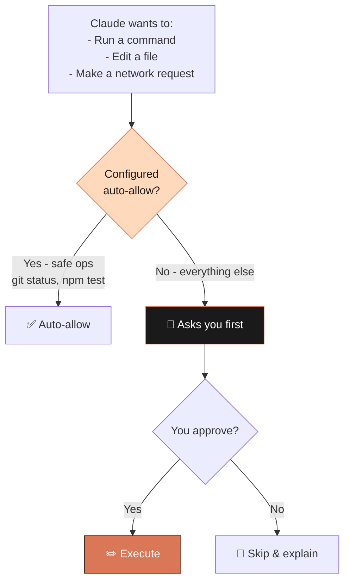
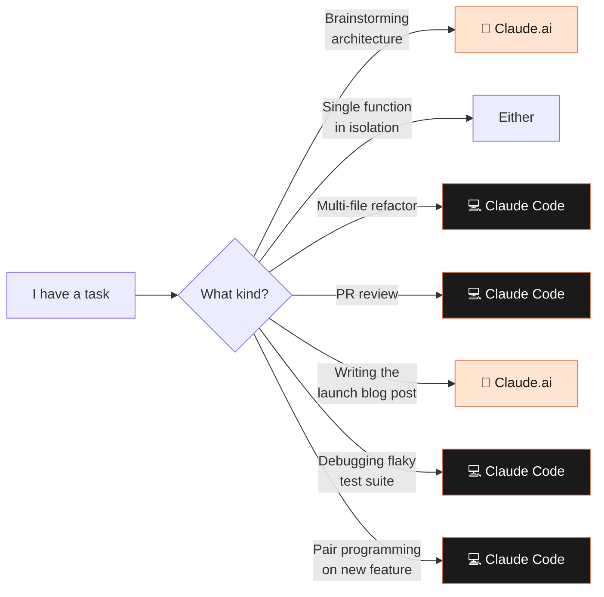

# Module 05 — Claude Code: Agentic Coding from Your Terminal

> **Goal:** Install Claude Code, run your first session, and use it as a real coding partner on a real project.

⏱️ **~30 minutes** &nbsp;&nbsp;&nbsp; 📊 **3 diagrams** &nbsp;&nbsp;&nbsp; 🎯 **Requires Node.js + a real codebase**

---

## 5.1 What is Claude Code?

**Claude Code** is a command-line agent that turns Claude into a developer who lives in your terminal.



Unlike Claude.ai (which talks about your code), Claude Code can:

- 📖 Read your repository
- 🧠 Plan a change across multiple files
- ✏️ **Edit files directly**
- ⚙️ Run commands (tests, builds, linters)
- 🔧 Use git, install packages, debug failures
- 🔁 Iterate until something actually works

---

## 5.2 Installation

### Prerequisites
- **Node.js 18+** ([download](https://nodejs.org))
- A terminal (macOS, Linux, or Windows via WSL)
- An [Anthropic API key](https://console.anthropic.com) **OR** a Claude.ai Pro/Max subscription

### Install via npm

```bash
npm install -g @anthropic-ai/claude-code
claude --version
```

📦 Official package: [@anthropic-ai/claude-code on npm](https://www.npmjs.com/package/@anthropic-ai/claude-code)

### First run

```bash
cd ~/projects/my-app
claude
```

You'll be prompted to authenticate on first use.

---

## 5.3 The core loop



---

## 5.4 Your First Session

```
> Take a look at this repo and give me a 5-bullet summary of what it does and how it's organized.

> The README is out of date — it still references the old folder structure.
  Read the actual repo and rewrite the README's "Project Structure" section.
  Show me the diff before applying.
```

You'll see Claude **plan** → **read** → **propose** → **ask permission** → **apply**.

---

## 5.5 The Core Commands

| Command | What it does |
|---|---|
| `/help` | Show all commands |
| `/model` | Switch model (opus, sonnet, opusplan) |
| `/clear` | Reset the conversation |
| `/init` | Generate a `CLAUDE.md` for this repo |
| `/cost` | Show token usage and cost so far |
| `/exit` | Quit |

### `CLAUDE.md` — your project's system prompt

Run `/init` once per repo. It creates a `CLAUDE.md` Claude reads at the start of every session.

```markdown
# CLAUDE.md

## Project: my-app
A Next.js 14 app with TypeScript, Tailwind, Prisma.

## Conventions
- Components live in `src/components/`, one per file, named exports.
- API routes use Zod for input validation.
- Never commit to `main` directly. Branch from `develop`.

## Commands
- `npm run dev`     — dev server
- `npm test`        — Jest test suite
- `npm run lint`    — ESLint
- `npm run build`   — production build (run before claiming "done")

## Don't
- Touch `src/legacy/`
- Modify migrations without explicit instruction
```

---

## 5.6 Plan first, execute second

```
┌─────────────────────────────────────────────────────────────┐
│  ❌  WITHOUT PLAN MODE                                      │
│                                                             │
│      You: "Add soft-delete to Posts"                        │
│      Claude: *immediately starts editing files*             │
│      You: *15 minutes later*: "no wait, that's wrong way"  │
│      → mess to undo                                         │
└─────────────────────────────────────────────────────────────┘

┌─────────────────────────────────────────────────────────────┐
│  ✅  WITH PLAN MODE                                         │
│                                                             │
│      You: "Plan adding soft-delete to Posts. Don't touch    │
│            files yet."                                      │
│      Claude: *writes a 7-step plan*                         │
│      You: *review, push back on step 4*                     │
│      Claude: *revises plan*                                 │
│      You: "Approved. Execute."                              │
│      → clean implementation                                 │
└─────────────────────────────────────────────────────────────┘
```

Use `/model opusplan` for an automatic Opus-plans / Sonnet-executes hybrid that saves cost while keeping quality.

---

## 5.7 Five Practical Workflows

### A — Bug fix from a stack trace

```
> I got this stack trace in production:
[paste]

Track down the cause. Don't change anything yet — show me where the
bug is and propose a fix.
```

### B — Refactor across files

```
> We're renaming `User.email_address` to `User.email` everywhere.
Find every usage, plan the migration (including DB), walk me through
it before changing files.
```

### C — Add a feature step-by-step

```
> Add a "soft delete" feature to the Posts model:
1. Add a `deleted_at` column
2. Update queries to exclude soft-deleted rows by default
3. Add a `withDeleted()` helper
4. Update tests

Implement step by step. Run tests after each step.
```

### D — Code review your own branch

```
> Review the changes in the current branch (compare to develop).
Flag anything risky, anything that violates our conventions in
CLAUDE.md, and anything missing tests.
```

### E — Onboard to a new repo

```
> I just inherited this codebase. Spend a few minutes exploring it,
then teach me the architecture in 10 minutes. Start with a high-level
diagram, drill into the 3 most important modules.
```

---

## 5.8 Permissions & Safety



> 🛑 **Never run Claude Code on a directory you can't afford to lose.** Use git. Commit before big agentic runs. You'll thank yourself.

---

## 5.9 Tips From Power Users

```
1. Always start with a plan.
   It's faster to throw away a bad plan than a bad commit.

2. Keep CLAUDE.md curated.
   Whenever you correct Claude on a convention, add it to the file.

3. Use small models for grunt work.
   Sonnet/Haiku for repetitive edits, Opus for architecture.

4. Commit often.
   After each successful step: git add . && git commit. Easy rollback.

5. Don't watch silently.
   If Claude is going down a wrong path, interrupt. You're the senior.

6. Watch the cost.
   /cost shows token usage. Stay aware if you're paying per token.
```

---

## 5.10 When to Use Claude Code vs. Claude.ai



A lot of pros use both: **Claude.ai for thinking, Claude Code for shipping**.

---

## ✅ Module 5 Checkpoint

You should now have:

- [ ] Claude Code installed and authenticated
- [ ] A `CLAUDE.md` in at least one of your real repos
- [ ] Run a real change (bug fix, refactor, or feature) end-to-end

> 👉 **Next up:** [Module 06 — API Development](../06-api-development/) — building your own apps powered by Claude.

---

## 📚 Further reading

- [Claude Code official docs](https://docs.claude.com/en/docs/claude-code/overview)
- [Claude Code on npm](https://www.npmjs.com/package/@anthropic-ai/claude-code)

---

| ← Previous | 🏠 Home | Next → |
|---|---|---|
| [Module 04 — Claude.ai Features](../04-features/) | [Course README](../README.md) | [Module 06 — API Development](../06-api-development/) |
