# 📊 The Visual Reference

> All the key diagrams from the course in one place. Bookmark this page.

---

## 🗺️ Course flow

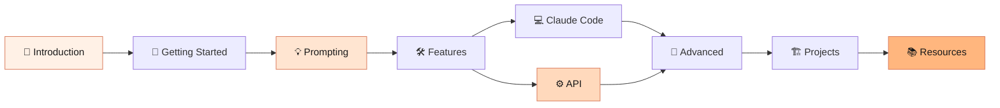

---

## 🧠 The three Claude surfaces

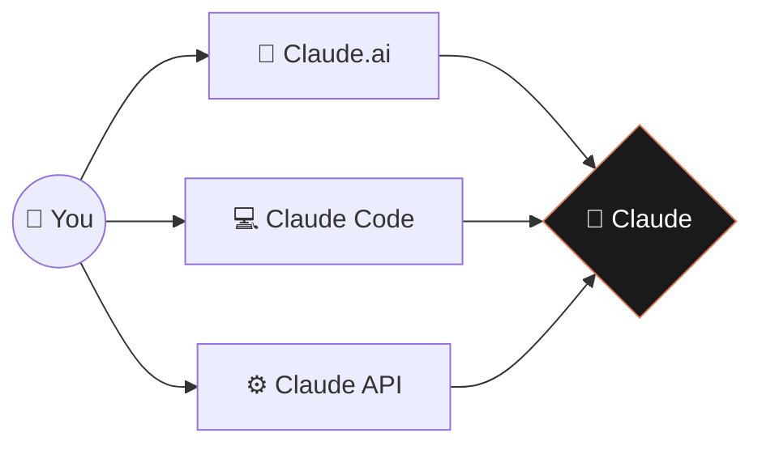

---

## 💎 The model family

```
                          INTELLIGENCE
                              ▲
                       💎 Opus│
                              │
                              │  ⚡ Sonnet
                              │
                              │            🚀 Haiku
                              └──────────────────────────►
                                                  SPEED & COST


   Opus    →  Hardest tasks: complex reasoning, agentic coding
   Sonnet  →  Daily driver: 90% of production work
   Haiku   →  High volume: classification, simple Q&A
```

---

## 🎯 The 6 ingredients of a great prompt

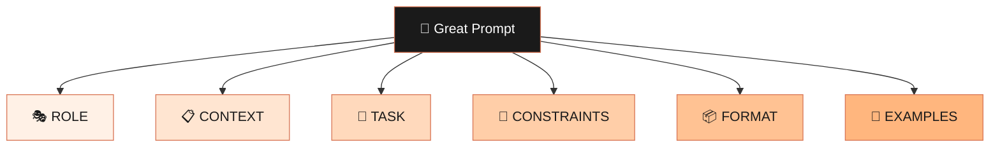

---

## 🛠️ Diagnosing a bad prompt

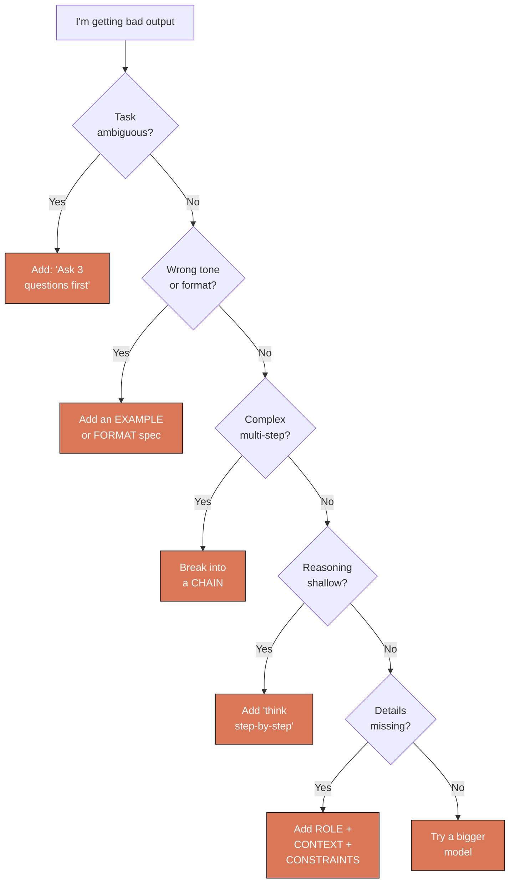

---

## 📁 The Claude.ai feature universe

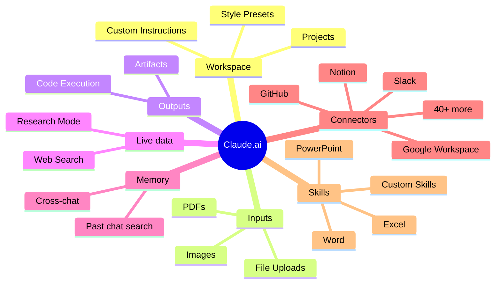

---

## 🔄 Claude Code's core loop

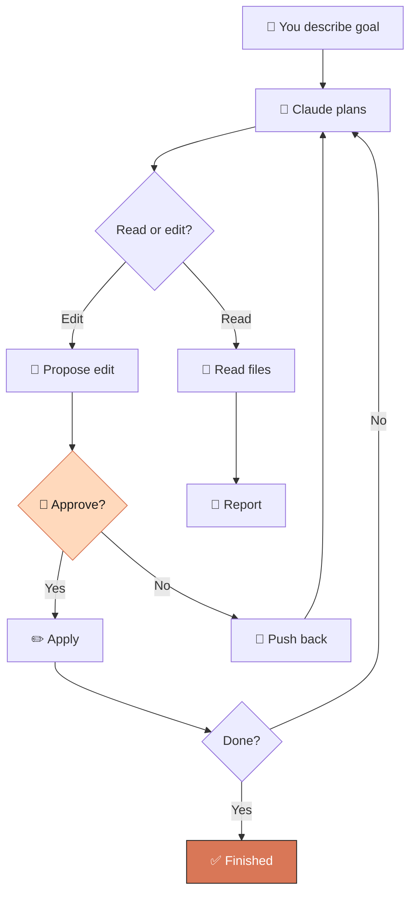

---

## 🤖 The agent loop (API)

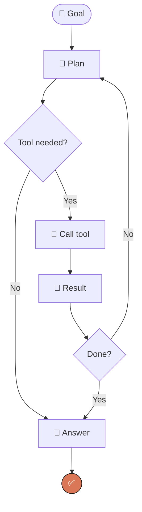

---

## 🔌 Tool use sequence

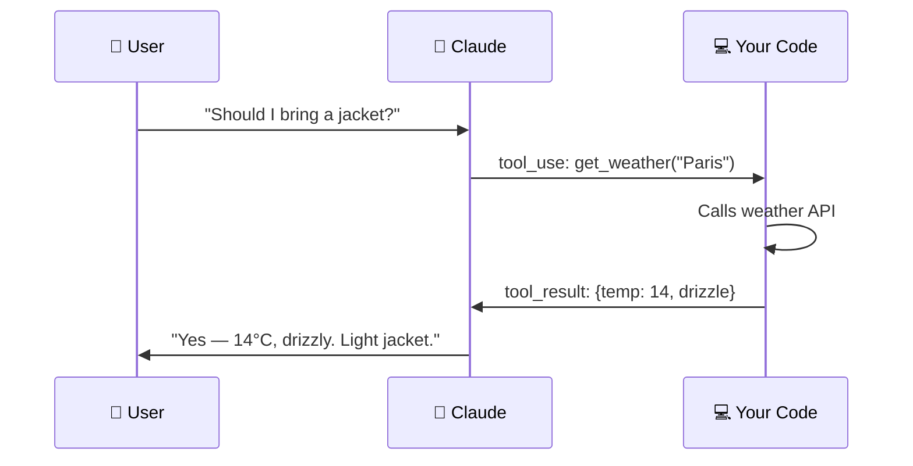

---

## 🌐 MCP architecture

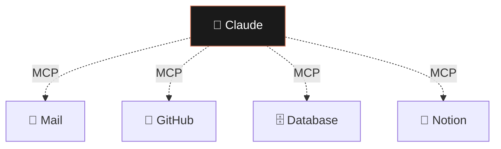

---

## 💰 The cost-saving router pattern

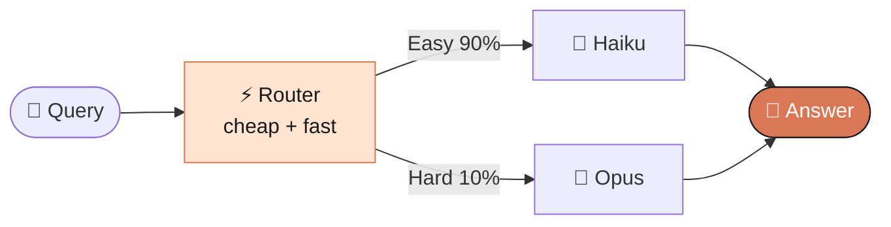

---

## 🚀 Production checklist flow

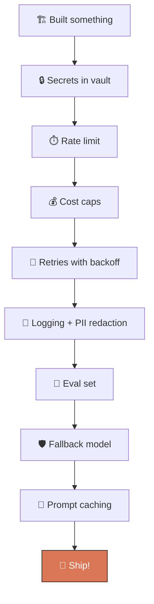

---

## 📚 The four projects (Module 8)

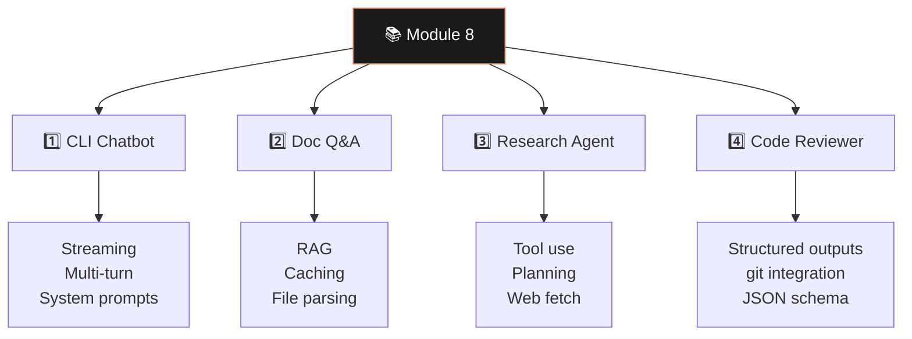

---

> 👉 Want this interactively? Open [`hub.html`](../hub.html) in your browser.
