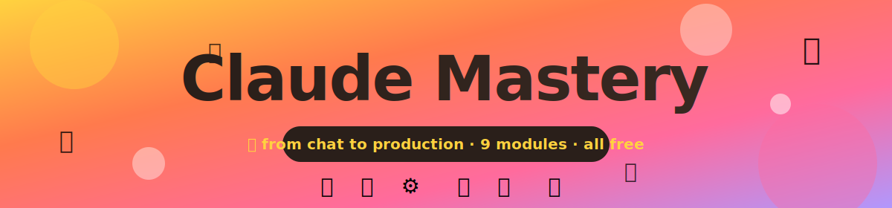

<div align="center">



# 🎓 Claude Mastery

### *Your end-to-end guide to getting the most out of Anthropic's Claude.*

From your very first chat → all the way to shipping production agents.

[](https://opensource.org/licenses/MIT)
[](https://claude.ai)
[](#-course-map)
[](./06-api-development/examples/)
[](./09-resources/visual-reference.md)
[](CONTRIBUTING.md)

<a href="./01-introduction/"></a>
<a href="./hub.html"></a>

</div>


## 🎯 The course at a glance

| | | | | |
|---|---|---|---|---|
| 👋 **01** Intro | → | 🚀 **02** Getting Started | → | 💡 **03** Prompting |
| | | | | ↓ |
| 🏗️ **08** Projects | ← | 🧪 **07** Advanced | ← | 🛠️ **04** Features |
| ↓ | | ↑ | | ↓ |
| 📚 **09** Resources | | ⚙️ **06** API | ← | 💻 **05** Claude Code |

> [!TIP]
> **Path through the course:** Start at 01 → walk through 02–04 → branch into 05 (terminal) **and/or** 06 (API) → both flow into 07 → projects in 08 → reference in 09.

> [!NOTE]
> **New here?** Open [`hub.html`](./hub.html) in your browser for an **interactive course dashboard** with progress tracking, a live prompt builder, and a model picker.


## 📖 About this course

Whether you're a curious beginner who just opened claude.ai for the first time, a power user who wants to squeeze more out of every prompt, or a developer integrating Claude into a product — **this repo has a track for you**.

### 🌈 What you'll learn

| Topic | What's in it |
|---|---|
| 🌱 **Foundations** | What is Claude? · Model family · Ethics & limits · When to use it |
| 💡 **Prompting** | 6 ingredients · 10 techniques · 30 patterns · Decision trees |
| 🛠️ **Features** | Projects · Artifacts · Files · Connectors · Memory · Skills |
| ⚙️ **Building** | Claude Code · Python SDK · TypeScript SDK · Tool use · Vision · Streaming |
| 🧪 **Advanced** | Extended thinking · Agents · MCP · Computer use · Evals |
| 🏗️ **Projects** | CLI Chatbot · Doc Q&A · Research Agent · Code Reviewer |


## 🗺️ Course map

| # | Module | Visual focus | What you'll learn |
|---|---|---|---|
| 🟡 **01** | [👋 Introduction](./01-introduction/) | 📊 Model family chart | What Claude is, when to use it |
| 🟠 **02** | [🚀 Getting Started](./02-getting-started/) | 🖼️ UI tour | Setup, plans, apps, first chat |
| 🔴 **03** | [💡 Prompt Engineering](./03-prompting/) | 🎯 Anatomy diagram | The 6-part prompt formula |
| 🟣 **04** | [🛠️ Claude.ai Features](./04-features/) | 🧩 Feature map | Projects, Artifacts, Connectors |
| 🔵 **05** | [💻 Claude Code](./05-claude-code/) | 🔄 Workflow flowchart | Agentic coding from your terminal |
| 🟢 **06** | [⚙️ API Development](./06-api-development/) | ⚙️ Architecture diagrams | Build your own Claude-powered apps |
| 🟡 **07** | [🧪 Advanced Techniques](./07-advanced-techniques/) | 🤖 Agent loop diagram | Extended thinking, MCP, evals |
| 🟠 **08** | [🏗️ Real-World Projects](./08-real-world-projects/) | 🏗️ System diagrams | 4 hands-on builds with full code |
| 🔴 **09** | [📚 Resources](./09-resources/) | 🧾 Cheat sheets | Glossary, FAQ, links |


## ✨ What makes this course different

<table>
<tr>
<td width="33%" align="center" valign="top">

### 📊
**70+ visuals**

Tables, flows, decision trees, ASCII diagrams. **See** concepts, don't just read about them.

</td>
<td width="33%" align="center" valign="top">

### 💻
**13 runnable scripts**

Copy them, run them, break them, adapt them. Python + TypeScript covered.

</td>
<td width="33%" align="center" valign="top">

### 🎯
**30 ready prompts**

Drop-in templates from the [prompt cookbook](./09-resources/prompt-cookbook.md). Steal liberally.

</td>
</tr>
<tr>
<td width="33%" align="center" valign="top">

### 🎮
**Interactive hub**

Track progress + build prompts live in your browser. [Open `hub.html`](./hub.html).

</td>
<td width="33%" align="center" valign="top">

### 🧭
**Decision trees**

Pick the right model, the right tool, the right prompt — every time.

</td>
<td width="33%" align="center" valign="top">

### 🆓
**100% free**

MIT license. Fork it, remix it, share it. No paywall, no email gate.

</td>
</tr>
</table>


## 📈 Suggested learning paths

**What's your goal?** Pick one and follow the trail. 👇

| Path | Best for | Modules to follow |
|---|---|---|
| 🎨 **A — Power User** | Just want to use Claude well | `01 → 02 → 03 → 04 → 09` |
| ⚙️ **B — Developer** | Build apps with the API | `01 → 03 → 06 → 07 → 08 → 09` |
| 💻 **C — Engineer** | Ship code faster | `01 → 03 → 05 → 07 → 09` |
| 🏆 **D — Complete** | All of it, in order | `01 → 02 → 03 → 04 → 05 → 06 → 07 → 08 → 09` |


## 🚀 Quick start

```bash
# 1. Clone the repo
git clone https://github.com/gaferto612/claude-mastery-course.git
cd claude-mastery-course

# 2. Open the interactive hub (recommended!)
open hub.html        # macOS
xdg-open hub.html    # Linux
start hub.html       # Windows

# 3. Or jump into module 01 in markdown
open 01-introduction/README.md

# 4. For code examples (when you reach module 06)
pip install anthropic            # Python
npm install @anthropic-ai/sdk    # TypeScript / Node
export ANTHROPIC_API_KEY="sk-ant-..."   # never commit this
```

> [!CAUTION]
> **Treat your API key like a password.** Use environment variables or a `.env` file (already in `.gitignore`) — never hardcode keys, never commit them, and rotate immediately if one leaks.


## 🧰 What you'll need

| | Required? | What for |
|---|---|---|
| ☁️ Free [Claude.ai](https://claude.ai) account | ✅ Yes | Modules 01–04 |
| 💎 Pro subscription | 🌟 Recommended | Better models, Projects, Connectors |
| 🔑 [Anthropic API key](https://console.anthropic.com) | For modules 06+ | Build your own apps |
| 📦 Node.js 18+ | For modules 05–06 | Claude Code & TS SDK |
| 🐍 Python 3.9+ | For modules 06+ | Python SDK examples |
| 🧪 A real project to apply this to | 💪 Strongly recommended | Learning sticks when it solves a real problem |


## 📜 License & contributing

> [!IMPORTANT]
> This course is released under the [**MIT License**](LICENSE) — free to use, fork, remix, and share.

Found a typo? Have a better example? See [**CONTRIBUTING.md**](CONTRIBUTING.md). PRs welcome!

This project follows a [Code of Conduct](CODE_OF_CONDUCT.md) — please read it before participating. Notable changes are tracked in the [CHANGELOG](CHANGELOG.md).


<div align="center">

### ⭐ If this course helps you, please star the repo so others can find it.

<sub>Made with ❤️ and a lot of Claude</sub>

</div>
